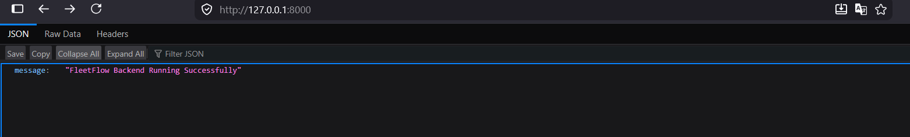

# FleetFlow – Development Log

## Developer Information

- **Name:** Rohit
- **Branch:** rohit

---

# Development Log

## Day 1 – Project Setup (02 July 2026)

### Objectives

- Set up the local development environment.
- Configure Git and GitHub.
- Create the backend project structure.
- Run the FastAPI application successfully.

### Tasks Completed

- Cloned the project repository.
- Created and switched to the `rohit` branch.
- Created a Python virtual environment.
- Installed the required dependencies.
- Created the backend project structure.
- Configured the FastAPI application.
- Successfully ran the backend server using Uvicorn.

### Output

The application successfully returned the expected response at:

`http://127.0.0.1:8000`

#### Screenshot

### Challenges Faced

- Resolved PowerShell execution policy issues.
- Fixed the project folder structure.
- Configured the correct Python interpreter.
- Recreated the virtual environment and installed project dependencies.

---

## Day 2 – Database & ORM Setup (07 July 2026)

### Objectives

- Configure PostgreSQL with FastAPI.
- Implement SQLAlchemy ORM models.
- Set up Alembic for database migrations.
- Generate and apply the initial database schema.

### Tasks Completed

- Installed and configured PostgreSQL.
- Created the `fleetflow_db` database.
- Connected FastAPI to PostgreSQL using SQLAlchemy.
- Configured environment variables using a `.env` file.
- Created SQLAlchemy models:
  - User
  - Driver
  - Vehicle
  - Shipment
- Initialized Alembic for database migrations.
- Configured Alembic to use the project environment configuration.
- Generated the initial migration.
- Applied the migration to create database tables.
- Verified successful database connectivity and schema synchronization.

### Output

Successfully created the following database tables:

- Users
- Drivers
- Vehicles
- Shipments

### Challenges Faced

- Resolved PostgreSQL connection issues caused by special characters in the database password.
- Configured Alembic to read the database URL from the `.env` file.
- Verified that database models and migrations remained synchronized after configuration changes.

---

## Day 3 – Database Relationships & API Foundation (08 July 2026)

### Objectives

- Improve the database schema.
- Establish relationships between database tables.
- Prepare the backend for CRUD operations and REST APIs.

### Tasks Completed

- Enhanced SQLAlchemy models for:
  - User
  - Driver
  - Vehicle
  - Shipment
- Added additional fields to better match the project requirements.
- Implemented database relationships using SQLAlchemy:
  - User ↔ Driver (One-to-One)
  - Driver ↔ Vehicle (One-to-One)
  - Vehicle ↔ Shipment (One-to-Many)
- Generated and applied Alembic migrations for the updated schema and foreign key relationships.
- Created the initial Pydantic schema for the User model.
- Configured the database session dependency (`get_db`) for FastAPI.
- Organized the project structure for upcoming CRUD operations and API development.

### Output

Successfully established relational database tables with foreign key constraints and prepared the backend architecture for REST API implementation.

### Challenges Faced

- Learned how SQLAlchemy relationships differ from database foreign keys.
- Generated separate Alembic migrations while updating the database schema.
- Verified that the database stayed synchronized with the updated models.

### Next Steps

- Implement CRUD operations for the User module.
- Develop FastAPI routers and API endpoints.
- Implement password hashing and JWT authentication.
- Build role-based access control.

---

## Day 4 – User Management & Authentication (10–12 July 2026)

### Objectives

- Build the User module.
- Implement secure authentication.
- Protect API endpoints using JWT.

### Tasks Completed

- Implemented complete User CRUD functionality.
- Created request and response schemas using Pydantic.
- Separated business logic into Routers, Services, Models and Schemas.
- Added password hashing using Passlib and Bcrypt.
- Implemented JWT Authentication using `python-jose`.
- Added login functionality using OAuth2 Password Flow.
- Configured Swagger UI authentication using the **Authorize** feature.
- Protected API endpoints using dependency injection.
- Tested authentication and secured routes through Swagger.

### Output

Successfully implemented a secure authentication system where users can log in, receive JWT access tokens and access protected APIs.

### Challenges Faced

- Understanding the difference between password hashing and JWT authentication took some experimentation.
- Fixed authentication issues caused by incorrect OAuth2 login configuration.
- Learned how FastAPI's dependency injection helps secure endpoints.

### Next Steps

- Develop Driver, Vehicle and Shipment APIs.
- Implement dashboard functionality.
- Add role-based access control.

---

## Day 5 – Driver, Vehicle & Shipment Modules (13–15 July 2026)

### Objectives

- Complete CRUD functionality for all project modules.
- Improve the Shipment module.
- Prepare the backend for Milestone 1 completion.

### Tasks Completed

- Implemented CRUD operations for:
  - Driver
  - Vehicle
  - Shipment
- Created dedicated routers and service layers for each module.
- Added automatic shipment tracking number generation.
- Introduced Shipment Status using Enums.
- Implemented shipment status updates.
- Generated and applied Alembic migrations for database updates.
- Tested all APIs using Swagger.

### Output

Successfully completed CRUD APIs for all core FleetFlow modules.

### Challenges Faced

- Faced Alembic migration issues while modifying the Shipment model.
- Learned how PostgreSQL handles Enums differently from normal string fields.
- Updated migration files to correctly synchronize database changes.

### Next Steps

- Build Dashboard APIs.
- Implement Role-Based Access Control.
- Perform final testing and project cleanup.

---

## Day 6 – Dashboard, RBAC & Project Cleanup (16–17 July 2026)

### Objectives

- Improve backend security.
- Finalize Milestone 1.
- Review and clean the overall project.

### Tasks Completed

- Developed Dashboard APIs showing:
  - Total Users
  - Total Drivers
  - Total Vehicles
  - Total Shipments
- Implemented Role-Based Access Control (RBAC).
- Restricted administrative APIs to Admin users.
- Tested authorization using both Admin and Driver accounts.
- Moved project configuration into a centralized configuration file.
- Stored JWT configuration and database settings using environment variables.
- Removed unused imports and cleaned the project structure.
- Performed a complete backend code review.

### Output

Successfully completed Milestone 1 with authentication, authorization, dashboard APIs and fully functional CRUD operations.

### Challenges Faced

This phase was more about polishing than writing new features. One of the biggest learnings was understanding the difference between **authentication** (who the user is) and **authorization** (what the user is allowed to do). Refactoring the project configuration to use environment variables without breaking existing functionality was also a valuable experience.

---

# Milestone 1 Summary

By the end of Milestone 1, the backend includes:

- ✅ FastAPI Backend
- ✅ PostgreSQL Integration
- ✅ SQLAlchemy ORM
- ✅ Alembic Database Migrations
- ✅ User Management
- ✅ Driver Management
- ✅ Vehicle Management
- ✅ Shipment Management
- ✅ Dashboard API
- ✅ JWT Authentication
- ✅ Password Hashing
- ✅ OAuth2 Login
- ✅ Role-Based Access Control (RBAC)
- ✅ Environment Variable Configuration
- ✅ Layered Backend Architecture (Routers → Services → Models)

---
